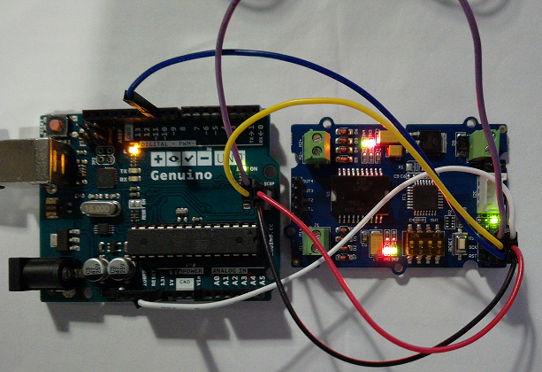

Grove - I2C Motor Driver
------------------------

A library has been made up at a [new repository](https://github.com/Seeed-Studio/Grove_I2C_Motor_Driver_v1_3), please refer to it.

This is an Arduino example for [Grove - I2C Motor Driver](http://www.seeedstudio.com/depot/grove-i2c-motor-driver-p-907.html?cPath=91_92)

[](http://www.seeedstudio.com/depot/grove-i2c-motor-driver-p-907.html?cPath=91_92)

## Firmware update

Users who got this motor driver can use AVR ISP programmer mkII to burn the new firmware at 
"firmware/images/mega8motor_v4.hex"

### Changelogs: 
- mega8motor_v3.hex: fixed i2cdetect block on raspberry pi
- mega8motor_v4.hex: Use arduino Wire as I2C library.


### Update using AVR ISP programmer mkII
Tools to prepare:
- AVR ISP programmer mkII
- avrdude

Upload firmware Command:
```
avrdude -p m8 -c avrisp2 -P usb -U flash:w:mega8motor_v4.hex
```

### Update using Arduino Uno (Genuino Uno)
Tools to prepare:
- Arduino Uno or Genuino Uno
- Arduino IDE (version >= 1.6)

Steps under Windows: 

1. Open Arduino IDE, connect the Arduino Uno to your PC.

2. Load the sketch "ArduinoISP" into the Arduino Uno, follow steps [here](https://www.arduino.cc/en/Tutorial/ArduinoISP#toc5).

3. Connect Arduino and I2C-Motor-Driver, like below picture.
<div>
        <table border="0">
	  <tr align="center">
	    <th>Arduino Pin/Signal</th>
	    <th>Line Color</th>
	    <th>I2C-Motor-Driver J2 Pin/Signal</th>
	  </tr>
	  <tr align="center">
	    <td>ICSP.1/MISO</td>
	    <td>Purple</td>
	    <td>1 /MISO</td>
	  </tr>
	  <tr align="center">
	    <td>5V/5V</td>
	    <td>White</td>
	    <td>2 / VCC</td>
	  </tr>
	  <tr align="center">
	    <td>ICSP.3/SCK</td>
	    <td>Yellow</td>
	    <td>3 / SCK</td>
	  </tr>
	  <tr align="center">
	    <td>ICSP.4/MOSI</td>
	    <td>Red</td>
	    <td>4 /MOSI</td>
	  </tr>
	  <tr align="center">
	    <td>10/RST</td>
	    <td>Blue</td>
	    <td>5 / RST</td>
	  </tr>
	  <tr align="center">
	    <td>ICSP.6/GND</td>
	    <td>Black</td>
	    <td>6 / GND</td>
	  </tr>
	</table>
</div>

4. Place mega8motor_v4.hex into Arduino IDE installation directory
(F:\TaryInst\Arduino for example, change to your specific directory)

5. Open Windows [Command Prompt](https://www.lifewire.com/how-to-open-command-prompt-2618089), then
enter below commands to start the update (change the path F:\TaryInst\Arduino to your specific directory, change COM24 after -P to your specific Arduino COM port)

```
CD /D F:\TaryInst\Arduino
SET AVRDUDE=hardware\tools\avr\bin\avrdude.exe
SET DUDECONF=hardware\tools\avr\etc\avrdude.conf
%AVRDUDE% -C %DUDECONF% -p m8 -c stk500v1 -PCOM24 -b19200 -U flash:w:mega8motor_v4.hex
%AVRDUDE% -C %DUDECONF% -p m8 -c stk500v1 -PCOM24 -b19200 -U hfuse:w:0xD9:m -U lfuse:w:0xD4:m
```


For more information, please refer to [wiki page](http://wiki.seeedstudio.com/Grove-I2C_Motor_Driver_V1.3/).

----

This software is written by Seeed Studio<br>
and is licensed under [The LGPL License V2.1](http://www.seeedstudio.com/wiki/Grove_-_I2C_Motor_Driver_V1.1). 

Contributing to this software is warmly welcomed. You can do this basically by<br>
[forking](https://help.github.com/articles/fork-a-repo), committing modifications and then [pulling requests](https://help.github.com/articles/using-pull-requests) (follow the links above<br>
for operating guide). Adding change log and your contact into file header is encouraged.<br>
Thanks for your contribution.

Seeed Studio is an open hardware facilitation company based in Shenzhen, China. <br>
Benefiting from local manufacture power and convenient global logistic system, <br>
we integrate resources to serve new era of innovation. Seeed also works with <br>
global distributors and partners to push open hardware movement.<br>


[](https://github.com/igrigorik/ga-beacon)
